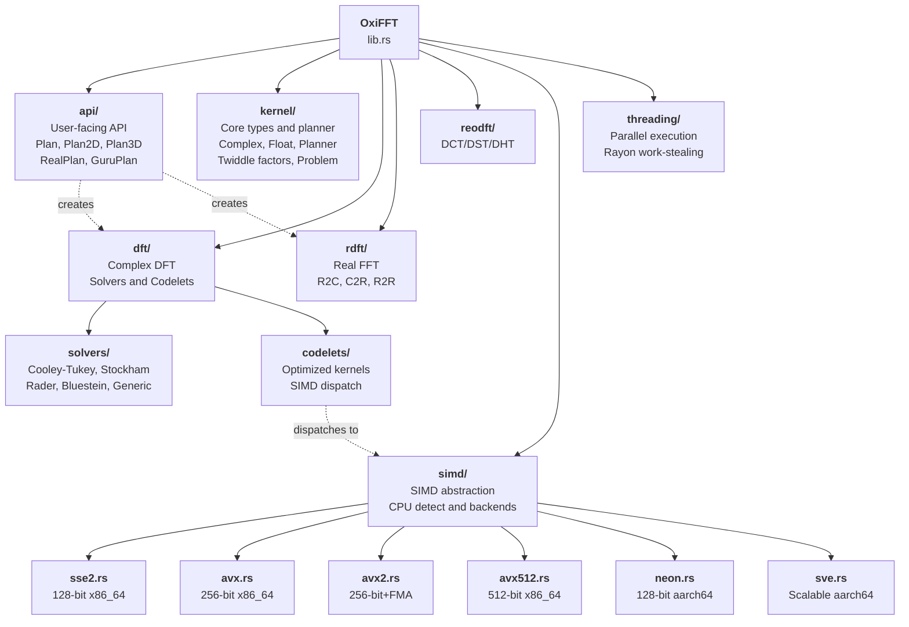
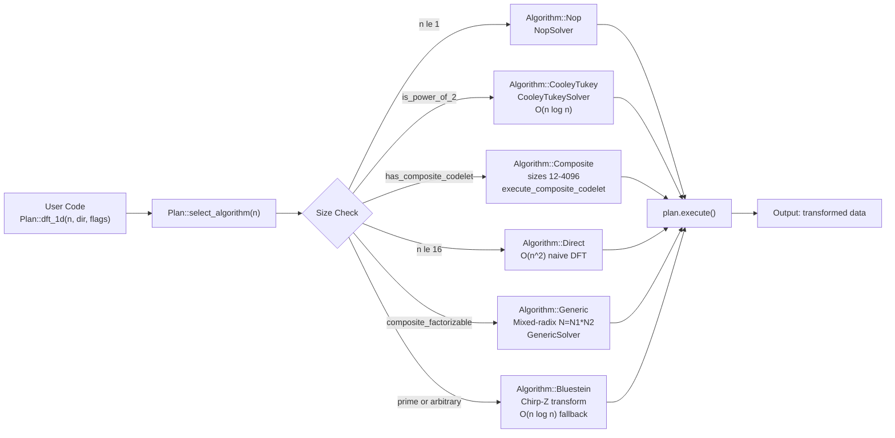
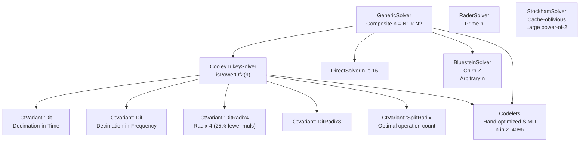
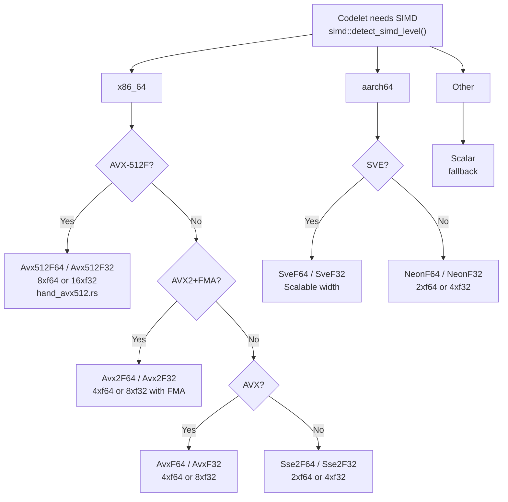

# OxiFFT Architecture Blueprint

## Overview

OxiFFT is a pure-Rust implementation of FFTW3 following its Problem-Plan-Solver design.

## Module Structure

```
oxifft/src/
├── api/            Public user-facing API (Plan, Plan2D, Plan3D, RealPlan, GuruPlan)
├── kernel/         Core planner, data structures, F16/F128 types, twiddle factors
├── dft/            Complex DFT implementations (codelets, solvers, composite)
├── rdft/           Real DFT (R2C, C2R, R2R)
├── reodft/         DCT/DST transforms (Types I-IV, DHT)
├── simd/           SIMD abstraction layer (SSE2, AVX, AVX2, AVX-512, NEON, SVE)
├── threading/      Parallel execution via Rayon
├── support/        Utilities (alignment, transpose, copy operations)
├── sparse/         Sparse FFT (FFAST algorithm, O(k log n))
├── pruned/         Pruned FFT (input/output pruning, Goertzel)
├── streaming/      STFT, window functions, mel filterbank, MFCC
├── signal/         Hilbert transform, Welch PSD, cepstrum, resampling
├── const_fft/      Compile-time FFT with const generics (sizes 2–1024)
├── nufft/          Non-uniform FFT (Type 1/2/3, Gaussian gridding)
├── frft/           Fractional Fourier Transform
├── conv/           FFT-based convolution and correlation
├── autodiff/       Automatic differentiation (forward/backward mode)
├── gpu/            GPU acceleration (CUDA, Metal)
├── mpi/            MPI distributed computing
└── wasm/           WebAssembly bindings
```

## Core Traits

```rust
pub trait Problem: Hash + Debug + Clone + Send + Sync { ... }
pub trait Plan: Send + Sync { ... }
pub trait Solver: Send + Sync { ... }
```

## Planning System

The planner selects the optimal solver for each problem via the Wisdom cache:

1. Hash the problem (size, direction, flags)
2. Check wisdom cache for a previously measured plan
3. If not cached, run timing trials (MEASURE/PATIENT/EXHAUSTIVE modes)
4. Store the winner in the wisdom cache for future reuse

## Architecture Diagrams

### Overall Module Organization



### Planning and Solver Dispatch



### Solver Hierarchy



### SIMD Runtime Dispatch



## Algorithm Selection

| Transform Size | Algorithm |
|----------------|-----------|
| Power of 2 | Cooley-Tukey DIT (radix-2/4/8, split-radix) |
| Power of 2 (large) | Stockham (cache-friendly, auto-sort) |
| Prime | Rader's algorithm or Bluestein |
| Composite | Mixed-radix or Cooley-Tukey generic |
| Small (≤8) | Direct O(n²) codelet |
| Any size | Bluestein (Chirp-Z, fallback) |

## SIMD Architecture

Runtime CPU feature detection selects the best backend:

- **x86_64**: AVX-512 > AVX2 > AVX > SSE2 > scalar
- **aarch64**: SVE > NEON > scalar
- **wasm32**: simd128 > scalar
- **other**: scalar fallback

For detailed algorithm citations and implementation notes, see the inline rustdoc comments
in each module.
